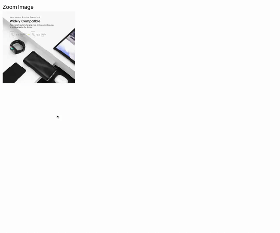
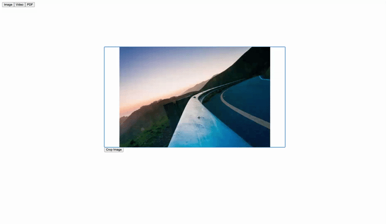
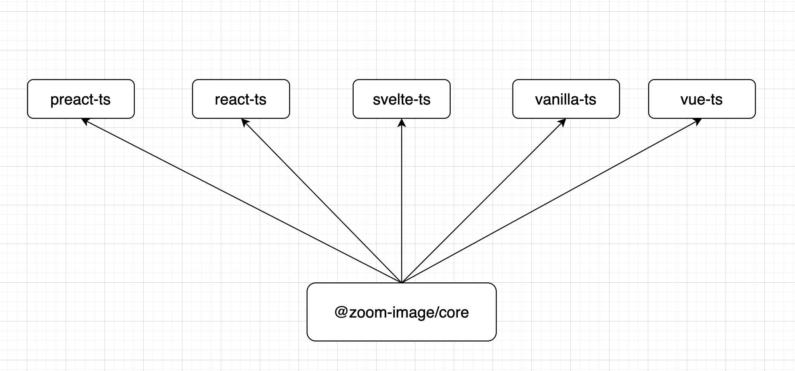

# Zoom Image

A little yet powerful library to zoom image on wheel / hover / pinch actions. It is typical experience on e-commerce
sites. Examples are written with Preact, React, Svelte, Vanilla JS and Vue.

- ✅ Zoom on hover
- 🚧 Zoom on wheel (Porting from battle-tested library of mine - https://react-zoomable-media.netlify.app/)

## Demo

### Zoom on hover



### Zoom on wheel



## Table of Contents

- [Usage](#usage)
- [API](#api)
- [Architecture](#architecture)
- [Development](#development)
- [Commands](#commands)
  - [With Preact](#with-preact)
  - [With React](#with-react)
  - [With Svelte](#with-svelte)
  - [With Vanilla JS](#with-vanilla-js)
  - [With Vue](#with-vue)

## Usage

### With Vanilla TS

```html
<div id="image-container" class="image-container">
  
</div>
```

```css
.image-container {
  /* This is important as the zoomed area will be positioned absolute as a child of image container */
  position: relative;
  /* Can be arbitrary value */
  width: 321px;
  /* Can be arbitrary value */
  height: 321px;
}

/* It's best to keep image sizes according to image container. Since img tag cannot have children. We need an extra container to achieve UI composition for zooming purpose */
.image {
  width: 100%;
  height: 100%;
}
```

```js
import { createZoomImageHover } from "@zoom-image/core"

const imageContainer = document.getElementById("image-container")
const cleanup = createZoomImageHover(imageContainer)

// Call cleanup function when you don't need zoom image anymore
```

### With React

```tsx
import React from "react"
import { ZoomImage } from "@zoom-image/react"
import "./styles.css"

function ZoomImageComponent() {
  const imageContainerRef = React.useRef<HTMLDivElement>(null)

  React.useEffect(() => {
    const cleanup = createZoomImageHover(imageContainer)

    return cleanup
  }, [])

  return (
    <div ref={imageContainerRef} class="image-container">
      
    </div>
  )
}
```

```css
.image-container {
  /* This is important as the zoomed area will be positioned absolute as a child of image container */
  position: relative;
  /* Can be arbitrary value */
  width: 321px;
  /* Can be arbitrary value */
  height: 321px;
}

/* It's best to keep image sizes according to image container. Since img tag cannot have children. We need an extra container to achieve UI composition for zooming purpose */
.image {
  width: 100%;
  height: 100%;
}
```

## API

### createZoomImageHover(container: HTMLElement, options)

The only required parameter is `container`. It is the container of the image. The image will be zoomed when you hover.
The result of this function is a cleanup function. You should call it when you don't need zoom image anymore.

By default, the zoomed image will be the same as the original image and placed as direct child of container next to the
original image on the right. You can customize it by passing optional `options` object as documented below.

| Name            |                              Type |                                                                                                                  Note |
| --------------- | --------------------------------: | --------------------------------------------------------------------------------------------------------------------: |
| customZoom      | { width: number; height: number } |                                                        The size of zoomed window where zoomed image will be displayed |
| zoomImageSource |                            string |                                                                                            The source of zoomed image |
| zoomLensClass   |                            string |                                                                      The css class will be added to zoom lens element |
| zoomImageClass  |                            string |                                                                   The css class will be added to zoomed image element |
| zoomTarget      |                       HTMLElement |                                                                                         The container of zoomed image |
| scaleFactor     |                            number | By default, zoomed image will have a scale of 1. The smaller the value, the bigger zoomed image and smaller zoom lens |

## Architecture



## Development

```bash
git clone https://github.com/willnguyen1312/zoom-image
cd zoom-image
pnpm install
```

## Commands

### With Preact

```bash
pnpm start-preact
```

### With React

```bash
pnpm start-react
```

### With Svelte

```bash
pnpm start-svelte
```

### With Vanilla JS

```bash
pnpm start-vanilla
```

### With Vue

```bash
pnpm start-vue
```

## Relevant projects

- [react-zoomable-media](https://github.com/willnguyen1312/react-zoomable-media) - The library I wrote for my previous
  company
- [zagjs](https://github.com/chakra-ui/zag) - The project's architecture is inspired by this library
- [js-image-zoom](https://github.com/malaman/js-image-zoom) - The internal working of zoom-image is inspired by this
  library

## License

MIT © [Nam Nguyen](https://namnguyen.design)
