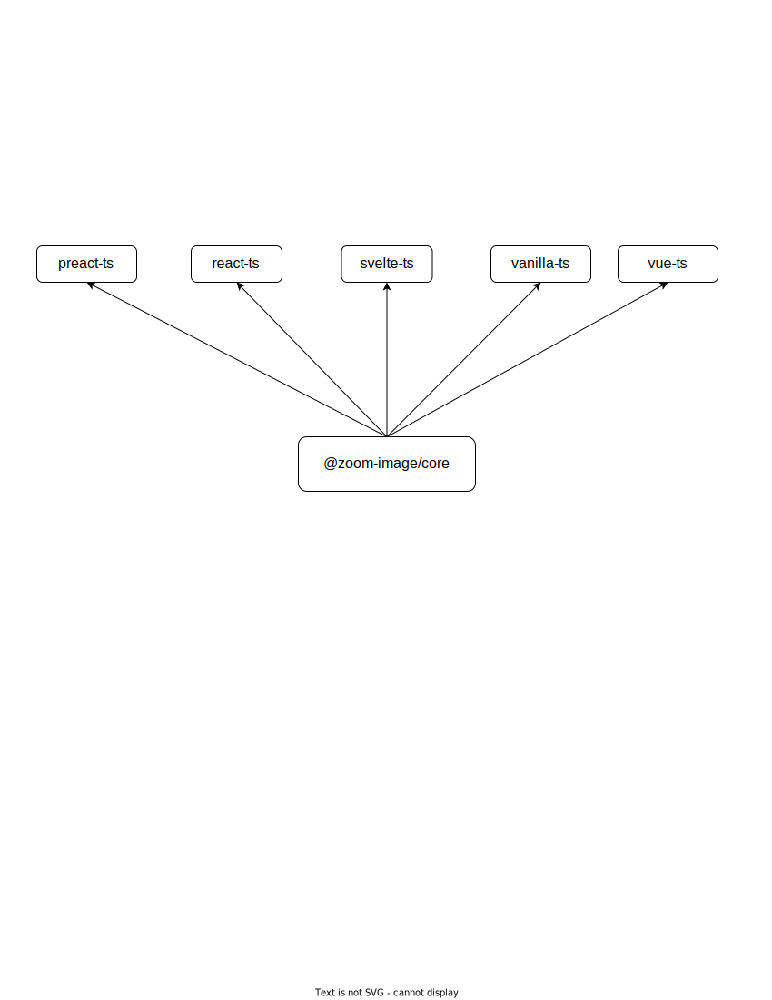

# Zoom Image

### A little library to zoom image on hover. It is typical experience on e-commerce sites. Examples are written with Preact, React, Svelte, Vanilla JS and Vue.

## Architecture



## Install

```bash
git clone https://github.com/willnguyen1312/zoom-image
cd zoom-image
pnpm install
```

## Developement

### With Preact

```bash
pnpm start-preact
```

### With React

```bash
pnpm start-react
```

### With Svelte

```bash
pnpm start-svelte
```

### With Vanilla JS

```bash
pnpm start-vanilla
```

### With Vue

```bash
pnpm start-vue
```

## License

MIT © [Nam Nguyen](https://namnguyen.design)
